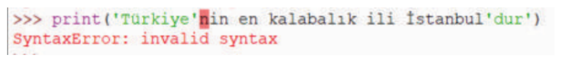
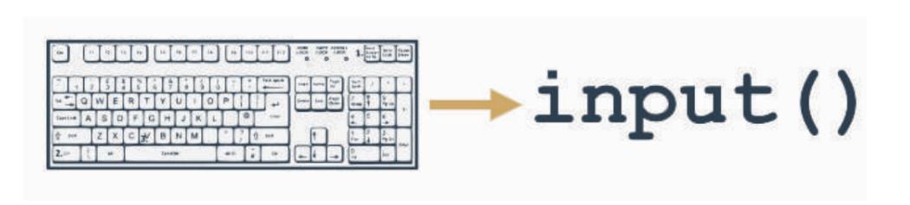

# Modül 3 
# YORUM SATIRLARI,DEĞİŞKENLER, VERİ TİPLERİ VE OPERATÖRLER
## Temel Fonksiyonlar

Programlama dillerinde fonksiyonlardan sıkça faydalanılmaktadır. Fonksiyonları kendimiz yazabilece-
ğimiz gibi, programlama dillerinin kütüphanelerinde bulunan hazır fonksiyonlar da kullanılabilir. Pyt-
hon’da pek çok hazır fonksiyon bulunmaktadır. Bunlara **yerleşik fonksiyonlar** da denilmektedir. Peki,neden fonksiyonlara ihtiyaç duyulmaktadır? Fonksiyonlar yapılan işlemleri kolaylaştırır ve zaman alıcı işlevleri kolay bir şekilde yerine getirilmesini sağlar. Bunun yanında **print( )** ve **input( )** gibi kullanıcıya bir çıktı vermek ve kullanıcıdan girdi almak için kullanılan, programlama dilinin olmazsa olmaz fonksiyonları vardır. Kullanıcıdan bir girdi almadan ya da yapılan işlemlerin sonucunu kullanıcıya vermeden
program yazmanın bir anlamı olmaz. Örneğin, kullanıcının vücut kitle indeksini hesaplamak için kul-
lanıcının boy ve kilo verisine ihtiyacımız vardır. Eğer kullanıcıdan bir girdi alınmazsa bu hesaplamayı
yapmak mümkün değildir.

Aynı şekilde yapılan işlemin sonucunu görmek için de sonucun ekranda görüntülenmesi, yani programın
kullanıcıya çıktı vermesi gerekmektedir.

Python’da konsola (etkileşimli kabuk) veriler yazdırmak istendiğinde **print( )** fonksiyonu, kullanıcıdan
bir girdi almak istendiğinde ise **input( )** fonksiyonu kullanılmalıdır. Ayrıca her iki fonksiyonun alacağı
parametreler ve/veya beraber kullanılabileceği fonksiyonlar bulunmaktadır.

Kullanıcıdan girdi alırken kimi zaman sayısal ifadeler (integer) kimi zaman da metinsel ifadeler (string)
istenebilir. Yani programın bir aşamasında kullanıcıdan ismini ya da yaşadığı şehri girmesi, başka bir
aşamasında ise yaş verisini alarak bununla ilgili işlem yapılabilir. Peki, Python girilen verinin sayısal
değer mi, yoksa metinsel bir ifade mi olduğunu nasıl anlayacak? İşte bu gibi durumlarda input( ) fonk-
siyonu ile beraber farklı fonksiyonlar da kullanılabilir.

## 3.2. print( ) Fonksiyonu

**print( )** fonksiyonu, konsola çıktı göndermek amacıyla kullanılır. Programların genellikle yapılan işlem-
ler sonucunu kullanıcıya sunması gerekir. Programda veri print( ) fonksiyonu ile Python’daki konsolda görüntülenebilir. **print( )** fonksiyonunun kullanımı:

**Örnek 1**


print "print sözcüğü yazılır"

print( ) parantez açılır

```print("değer")``` konsola gönderilecek değer bir metinsel ifade ise bu ifade çift tırnak, tek tırnak ya da
üç çift tırnak içinde yazılmalıdır.

```print('değer')```

```print("""değer""")```

Her üç kullanım da bize aynı çıktıyı verir. Eğer konsola gönderilecek değer bir değişken ya da sayısal bir
ifade ise bu durumda tırnak içerisinde yazmaya gerek yoktur.


**Örnek 2**

```python
print(5)
``` 

Burada **print( )** fonksiyonu kullanılırken parantez içerisinde kullanılan değerlere argüman denilmektedir. Python, **print( )** fonksiyonu argümanını kontrol ederek, belirtilen kurallara uyup uymadığını kontrol eder. Söz diziminin doğruluğu veya değişkenin tanımlanmış olması kontrol edilir. Kod, Python’un izin
verdiği tanımlamalara uyuyorsa çalıştırılarak konsol üzerinden sonuç görüntülenir. Aksi durumda hata
mesajı alınır.

**Örnek 3**

```python
print("python)
```
SyntaxError: EOL while scanning string literal

**Örnek 4**

```python
print(a)
```

SyntaxError: unexpected indent

Yukarıdaki durumlarda eksik olan tanımlamalar neticesinde, hata mesajı ile karşılaşılmıştır. Örnek 3’te
tırnak kapatılmamış, örnek 4’te ise değişken tanımlanmadığı için hata vermiştir. Doğru kullanım:

**Örnek 5**

```python
print("Merhaba, Python!")
```

Merhaba, Python!

**print( )** fonksiyonu kullanılırken, karakter dizilerinde çift tırnak, tek tırnak ya da üç çift tırnak kullanılabi-
lir. Aslında bu ayrıntının Python’da çok önemli bir yeri vardır.


**Örnek 6**

```python
print('Türkiye'nin en kalabalık ili İstanbul'dur')
```


Şekil 3.2: Örnek 6’nın çıktısı

SyntaxError: invalid syntax

## Şekil 3.2: Örnek 6’nın çıktısı

Örnek 6’daki kullanıma bakıldığında karakter dizisi tek tırnak işareti ile başlamış, ancak kesme işareti olarak kullanıldığı yerde sonlanmıştır **‘Türkiye’nin** daha sonraki ifadeler ise karakter dizisinden ziyade, farklı bir argüman olarak değerlendirilmiş ancak bunlarla ilgili bir tanımlama yapılmadığı için hata mesajı vermiştir. Burada çift tırnak ve tek tırnak beraber kullanılarak sorunun çözümüne gidilebilir.

**Örnek 7**

```python
print("Türkiye'nin en kalabalık ili İstanbul'dur")
```

Türkiye'nin en kalabalık ili İstanbul'dur

**print( )** fonksiyonu kullanılırken argüman değerleri arasında aritmetiksel işlemler yapılabilir.

**Örnek 8**

```python
print(2+2)
```

4

**print( )** fonksiyonu, bu şekilde aritmetik işlemler yapmak amacıyla kullanılabilir.

### 3.2.1. print( ) Fonksiyonu ile Kullanılabilen Parametreler

**print( )** fonksiyonu kullanılırken karakter dizilerinde tek tırnak ve çift tırnak işaretleri (‘ ,“ ,“““) kullanılır.
Bu işaretler karakter dizilerinin nerede başladığını ve bittiğini ifade eder.

### 3.2.2 Ters Taksim( \ )

**Örnek 9**

```python
print("Merhaba," Python "kullanıyorum")
```

SyntaxError: invalid syntax

Örnek 9’da çift tırnak işareti arasındaki “Merhaba, ” kelimesi karakter dizisi olarak algılandı ama sonrasında **Python** kelimesi çift tırnak içinde ve argümanlar arasında “,” virgül olmadığı için hata verdi. Bu problemi çözmek için **kaçış parametreleri (escape character)** kullanılmalıdır.

Aslında bu sorun, bir önceki bölümde çift tırnak ve tek tırnak’lar beraber kullanılarak çözülmüştü. Ancak
burada ters taksim ( \ ) işareti kullanılarak da bu sorun çözülebilir.

**Örnek 10**

```python
print('Bursa\'nın iskenderi meşhurdur.')
```
Bursa'nın iskenderi meşhurdur.

Örnek 10’da ters taksim işareti kullanılmamış olsaydı önceki bölümdeki gibi hata ile karşılaşılırdı. Burada \ karakteri kendinden sonra gelen kesme ‘ işaretinin dikkate alınmaması gerektiği anlamı vermektedir. Aynı işlem çift tırnak içinde de yapılabilir.


### 3.2.3. Alt Satır Başı (\n)


**print( )** fonksiyonu kullanılırken, karakter dizilerinde bazen alt satıra inme ihtiyacı duyulabilir. Python’da
en sık kullanılan kaçış parametresi **\n** parametresidir.

**Örnek 11**

```python
print("1. satır\n2. satır\n3. satır")
```

1. satır
2. satır
3. satır

Örnek 11’de görüldüğü üzere **\n*** parametresi kullanılarak program çıktısının alt alta yazılması sağlandı.

### 3.2.4. Sekme(\t)

Klavyeden **tab** tuşuna basıldığındaki gibi belirli karakter boşluk bırakılmasını sağlayan bir parametredir.

**Örnek 12**

```pyton
print("pazartesi \tsalı \tçarşamba")
```

pazartesi salı çarşamba

### 3.2.5. end( ) Parametresi

Bu parametre **print( )** fonksiyonu ile ekrana gönderilen değerlerin sonunda hangi işlemin yapılacağını
belirtmektedir.


**Örnek 13**

```python
print("Merhaba!")
print("Python")
```

Merhaba!

Python

Örnek 13’teki gibi bir kullanımda kodların çıktısı alt alta verilmiştir. Ancak bazı durumlarda prog-
ramın çıktısı birleştirilmek istenebilir. İlerleyen bölümlerde döngü konusunda, döngü değerini her seferinde konsola yazdırılmak istendiğinde bu değerler alt alta yazılacaktır. Döngünün büyük olduğu düşünülürse program sayfalar dolusu çıktı verebilir. İşte bu gibi durumlarda end parametresi çok işe yaramaktadır.


**Örnek 14**

```python
print("Merhaba!",end=" ")
print("Python")
```
Merhaba! Python

Örnek 14’te görüldüğü üzere **end** parametresi içinde iki tırnak arasında boşluk karakteri kullanıldığı için program çıktısını birleştirerek araya boşluk eklendi. Aynı işlem virgül kullanılarak yapılabilir:

**Örnek 15**

```python
print("Merhaba!",end=",")
print("Python")
```

Merhaba!,Python

Aslında **end** parametresinin içerisinde standart olarak **\n** parametresi vardır. Burada değer atanarak
varsayılan değer değiştirilmiştir.


### 3.2.6. sep () Parametresi

Önceki örnekte, **end** parametresi ile değerlerin sonunda hangi işlemin yapılacağı gösterilmişti. Tek bir **print( )** fonksiyonu birden fazla argüman alabilir. Her bir argümanın arasında farklı işlemler **sep**
parametresi ile yapılabilir.

**Örnek 16**

```python
print("pazartesi","salı","çarşamba","perşembe","cuma")
```
pazartesi salı çarşamba perşembe cuma

Örnek 16’daki gibi bir kullanımda, her bir argüman birbirinden virgül işareti ile ayrılmış ve program
çıktısı olarak tüm argümanların arasına birer boşluk bırakılarak ekrana yazdırılmıştır. Burada dikkat
edilmesi gereken bir başka nokta, **print( )** fonksiyonu içerisine gönderilen tüm değerleri belirli kurallar
çerçevesinde ekrana yazılmıştır. Her bir argüman’ın arasına **sep** parametresi yardımıyla birer kural belirlenmek istenirse,

**Örnek 17**

```python
print("pazartesi","salı","çarşamba","perşembe","cuma",sep="-")
```
pazartesi-salı-çarşamba-perşembe-cuma

### 3.2.7. Format( ) Metodu ile Biçimlendirme İşlemleri

Program yazarken bazı durumlarda bir string’in içinde daha önceden tanımlı string, float, int gibi farklı türden değerleri yerleştirmek isteyebiliriz. Böyle durumlar için Pythonda **format( )** metodu bulunmaktadır. Örneğin, programda 3 adet tam sayı değeri, bir string ifade ile beraber ekrana yazdırılmak istenebilir. Bunun için **format( )** metodu kullanılmalıdır.


**Örnek 18**

```python
a=5
b=6
c=9
print("girdiğiniz",a, b, "ve",c,"değerlerinin toplamı: ",a+b+c,"dir")
```

girdiğiniz 5 6 ve 9 değerlerinin toplamı: 20 dir
Örnek 18'deki gibi bir kullanım ve hata yapmaya müsait bir kullanımdır. Python bu gibi durumlar için
**print( )** fonksiyonunda format metodunun kullanımına olanak sağlar.

Kullanımı aşağıdaki şekildedir:

**Örnek 19**

```python
print("çıktı işlemi {} {} {}".format(1,2,3))
```
çıktı işlemi 1 2 3

Burada **print( )** fonksiyonunda kullanılan her bir **{}** ifadesine karşılık olarak format( ) metoduna bir
adet argüman verilmelidir. Önceki örnek bu şekilde yapılmak istenirse.

**Örnek 20**

```python
a=5
b=6
c=9
print("girdiğiniz {} , {} ve {} değerlerinin toplamı= {} dir".format(a,b,c,a+b+c))
```
girdiğiniz 5 , 6 ve 9 değerlerinin toplamı= 20 dir

Süslü parantez içine sayılar girerek format metodu ile hangi sıradaki değerin geleceği belirlenebilir.


**Örnek 21**

```python
print("{1} {0} {2}".format(10,"Python",20))
```
Python 10 20

Uygulama
Aşağıdaki örnekleri etkileşimli kabuk üzerinde yaparak çıktılarını gözlemleyiniz.
1. ```print("Memleket isterim,\nGök mavi, dal yeşil, tarla sarı olsun,")```

2. ```print("Memleket isterim,","Gök mavi, dal yeşil, tarla sarı olsun,")```

3. ```print("Memleket isterim,")```

```print("Gök mavi, dal yeşil" ,"tarla sarı olsun,")```

4. ```print("Memleket isterim,",end=" ")```

```print("Gök mavi, dal yeşil" ,"tarla sarı olsun,")```

5. ```print("Memleket","isterim","Gök mavi","dal", "yeşil",sep="-")```
6. ```print(" *")```

    ```print(" * *")```

    ```print(" * *")```

    ```print(" * *")```

    ```print("*** ***")```

    ```print(" * *")```

    ```print(" * *")```

    ```print(" *****")```

7. ```not1 = 55```

   ```not2 = 100```

   ```print('1.Sınav Notu:{} \n2.Sınav Notu:{}'.format(not1,not2))```

## 3.3. input( ) Fonksiyonu

Python’da **print( )** fonksiyonu sayesinde konsol ekranına çıktılar gönderilebilir. Önceki örneklerde bu işlem tanımlı veriler üzerinden yapılmıştır, yani kullanıcıdan bir değer almadan, program içerisinde yapılan değişken tanımlalamaları ile **print( )** fonksiyonu ile değerler ekrana yazdırılmıştır. Neredeyse tüm programlama dilleri verileri okur ve işler. Kullanıcıdan girdi almayan bir program sağır bir programdır.
**input( )** fonksiyonu kullanıldığında genellikle kullanıcının klavyeden bir girdi yapmasını bekler.



Şekil 3.3: input( ) girişi


Python’da input( ) fonksiyonu diğer programlama dillerinden daha işlevsel bir yapıya sahiptir. **input( )** fonksiyonuyla, **print( )** fonksiyonuna ihtiyaç duymadan kullanıcıya bilgi verilebilir. Ancak **input( )** fonksi-
yonu kullanılırken kullanıcıdan alınan değer bir değişkene atanmalıdır.

**Örnek 22**

```python
isim=input("isminizi giriniz: ")
print("merhaba! ",isim)
```

isminizi giriniz: ahmet

merhaba! ahmet


Örnek 22’de **input( )** fonksiyonu ile kullanıcıdan bir karakter dizisi girmesi beklenmiş ve sonuç ekrana
yazdırılmıştır. Peki, Python girilen değerin sayısal bir değer mi yoksa bir karakter dizisi mi olduğunu nasıl
anlayacak?

**Örnek 23**

```python
a=input("birinci sayıyı giriniz: ")
b=input("ikinci sayıyı giriniz: ")
print("girdiğiniz sayıların toplamı: ",a+b)
```

birinci sayıyı giriniz: 6


ikinci sayıyı giriniz: 8

girdiğiniz sayıların toplamı: 68

Örnek 23’te görüldüğü üzere uygulama bize hatalı bir çıktı vermiştir. Bu kullanımda her iki değer bir
karakter dizisi olarak algılanmış ve Python iki değer üzerinde toplama işlemi yapamadığı için yan yana
yazarak birleştirmiştir. Aşağıdaki örnekle bu durum daha iyi anlaşılacaktır:

**Örnek 24**

```python
print("ahmet"+"şahin")
```
ahmetşahin

Burada yapılan işlemle gerçekte bir toplama işlemi yapılmamış iki argüman birbirleriyle birleştirilmiştir.
**input( )** fonksiyonu kullanılırken girdi olarak sayısal ifadeler kullanılacağı zaman bu durumun Python’a
bildirilmesi gerekmektedir. Bunun için Örnek 25’teki kullanım uygulanmalıdır.

**Örnek 25**

```python
a=int(input("Bir sayı giriniz: "))
```
Bir sayı giriniz: 5

Örnek 25’te görüldüğü üzere **input( )** fonksiyonu, **int( )** fonksiyonunun içerisine alınarak girdi sayısal
ifadeye çevrilmiştir.

**Örnek 26**

```python
a=int(input("birinci sayıyı giriniz: "))
b=int(input("ikinci sayıyı giriniz: "))
print("girdiğiniz sayıların toplamı:",a+b)
```

birinci sayıyı giriniz: 5

ikinci sayıyı giriniz: 8

girdiğiniz sayıların toplamı: 13

Görüldüğü üzere burada yapılan işlemle girdiler sayılara dönüştürülmüş ve toplama işlemi yapılmıştır.

**input( )** fonksiyonu kullanılırken sık yapılan hataların başında hatalı veri girişleri gelmektedir. **int( )** fonksiyonu ile beraber integer ifade yerine string bir değer girilirse Python hata verir. Çünkü metinsel ifadeler

(a, b, isim, soyisim) sayılara dönüştürülemez.

**Örnek 27**

```python
a=int(input("birinci sayıyı giriniz: "))
b=int(input("ikinci sayıyı giriniz: "))
print("girdiğiniz sayıların toplamı:",a+b)
```

birinci sayıyı giriniz: 8

ikinci sayıyı giriniz: Ali


Traceback (most recent call last):

File "C:/Users/asus/Desktop/1.py", line 2, in \<module>
b=int(input("ikinci sayıyı giriniz: "))

ValueError: invalid literal for int( ) with base 10: 'Ali'

Yine benzer şekilde girilen ifadelerden birisi sayısal olup diğer ifade sayıya dönüştürülmezse, sayılarla metinsel ifadeler arasında aritmetiksel işlem yapılamayacağı için Python hata verecektir. Hataların ayıklanmasına yönelik çözümlere modül 13’te detaylı olarak değinilecektir.


**Örnek 28**

```python
a=int(input("birinci sayıyı giriniz: "))
b=input("ikinci sayıyı giriniz: ")
print("girdiğiniz sayıların toplamı:",a+b)
```

birinci sayıyı giriniz: 6

ikinci sayıyı giriniz: 9

Traceback (most recent call last):
File "C:/Users/asus/Desktop/1.py", line 3, in \<module>
print("girdiğiniz sayıların toplamı:",a+b)

TypeError: unsupported operand type(s) for +: 'int' and 'str'

Örnek 28’de **integer** ve **string** değerler arasında işlem yapılamayacağı için Python hata vermiştir.

**Örnek 29**

Kullanıcıdan abone numarası ve tüketim bilgisi alarak fatura tutarını hesaplayan programı yazınız.

```python
on_mesaj="Sayın "
mesaj_sonu=" nisan dönemi faturaınız: "
abone_no=input("abone numaranız")
tuketim=input("tuketim miktarı")
tuketim_tutari=int(tuketim)*4.0
mesaj=on_mesaj+abone_no+mesaj_sonu+tuketim+" tl dir."
print(mesaj)
```
abone numaranız: 123456

tuketim miktarı: 20

Sayın 123456 nisan dönemi faturaınız: 20 tl dir.
